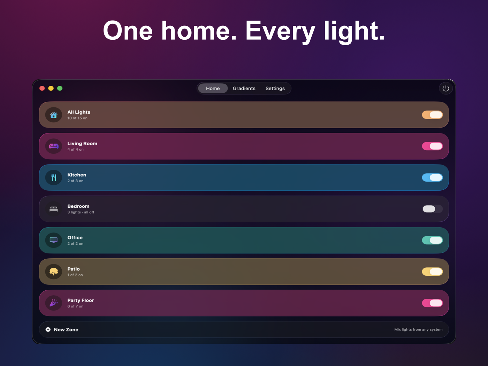
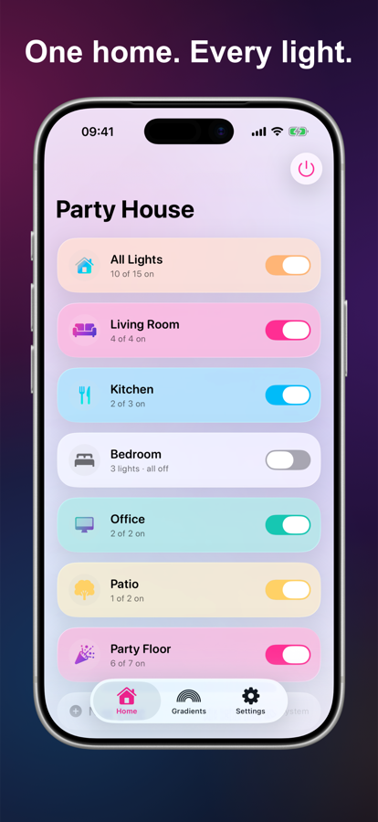
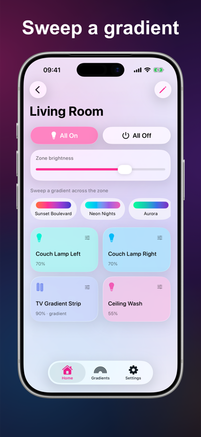
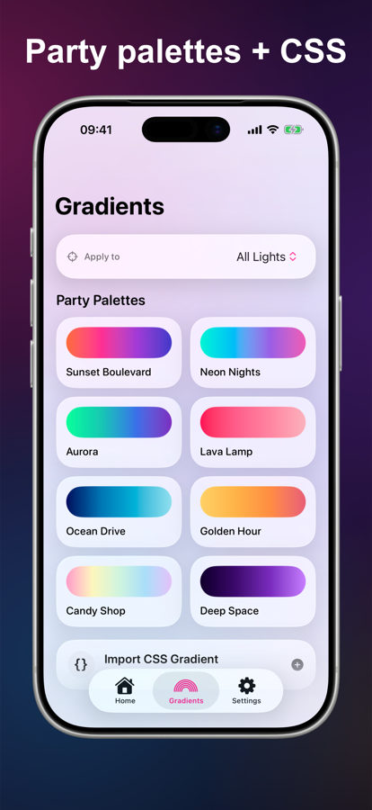

# Party House 🪩

[](https://github.com/yennster/party-house/actions/workflows/ci.yml)
[](LICENSE)


One beautiful, native app for every smart light in your house — iPhone, iPad, Mac,
menu bar, and widgets. Built with SwiftUI and Apple's Liquid Glass design for
iOS 26 / macOS 26.

**Completely free and open source.** No subscriptions, no in-app purchases, no ads,
no accounts, no locked "pro" tier — and no servers or analytics either. The entire
app is this MIT-licensed repo: read it, build it yourself, or grab it from the App
Store. Your lights, your network, your data.

Sweep a gradient across the whole house. Kill every light from a widget. Mix a Hue
bulb, a Tuya strip behind Home Assistant, and a LIFX lamp into one zone and treat
them as one.

<p align="center">
  
</p>
<p align="center">
  
  
  
</p>

*Every image above was generated by `Scripts/marketing-screenshots.sh` — demo mode →
XCUITest captures → fastlane frameit. No hardware, no Photoshop.*

## What it does

- **Philips Hue** — direct local connection to your bridge (CLIP v2 + server-sent
  events). Link-button pairing, live state, native gradients on gradient lightstrips,
  rate-limit-aware batching.
- **Home Assistant** — official HAKit WebSocket connection. Every `light.*` entity
  shows up: Tuya, Govee, WiZ, Zigbee, Matter, whatever HA can switch. Areas become
  zone suggestions. Internal + external URL with automatic failover, so it works
  from anywhere ([remote access guide](Docs/RemoteAccess.md)).
- **LIFX** *(beta)* — direct LAN protocol control, no cloud account. Untested against
  physical bulbs (the maintainer doesn't own any) — hence the beta badge; LIFX via
  Home Assistant is the supported fallback.
- **Zones that don't care where a light lives** — app-defined groups can mix lights
  from any provider, in any order. The implicit **All Lights** zone is always there:
  one tap turns off the entire house, regardless of how rooms are defined in Hue or HA.
- **Gradients** — built-in party palettes plus a CSS importer (`linear-gradient(...)`
  or a bare color list). The gradient is sampled in OKLab and distributed across the
  zone's lights in order; Hue gradient strips get a native multi-point slice so the
  gradient flows *through* them.
- **Dedupe** — a Hue light that Home Assistant re-exposes is detected by unique-id
  matching and hidden automatically (override per-light in Settings).
- **Mac menu bar** — zone picker, on/off, brightness, one-click palettes, hide-Dock-icon
  mode.
- **Widgets (iOS + macOS)** — Zone Toggle, Everything Off, and Party Gradients
  quick-apply, all interactive (App Intents — taps work without opening the app).
  The same intents are exposed to Siri, Spotlight, and Shortcuts.
- **iCloud sync** — pair once, use everywhere: connections, zones, and palettes sync
  via iCloud Key-Value Storage; the Hue app key and HA token travel in iCloud
  Keychain, end-to-end encrypted.
- **Looks right everywhere** — full light and dark mode support with an in-app
  System/Light/Dark override, one unified type scale, a borderless glass window on
  Mac, and app icon variants for light, dark, and tinted home screens.

## Project layout

```
project.yml                  XcodeGen project definition (xcodeproj is generated)
Packages/PartyHouseKit/      All the logic, as a Swift package
  PartyCore                  Models, zones, gradient engine, color math, stores, sync
  PartyHue                   Hue CLIP v2 client, discovery, pairing, SSE
  PartyHomeAssistant         HAKit-based provider + registries
  PartyLIFX                  LIFX LAN protocol client (UDP)
  PartyUI                    SwiftUI screens + Liquid Glass theme (shared iOS/macOS)
Apps/iOS, Apps/macOS         Thin app shells
Apps/Shared/Intents          App Intents (compiled into apps + widget extensions)
Apps/Widgets                 WidgetKit bundle (both platforms)
UITests/                     Demo-mode smoke tests + screenshot capture tests
Scripts/                     bootstrap, icon generation, screenshot automation
```

## Building

Requirements: Xcode 26+, [XcodeGen](https://github.com/yonaskolb/XcodeGen) (`brew install xcodegen`).

```sh
./Scripts/bootstrap.sh        # generates PartyHouse.xcodeproj + resolves packages
open PartyHouse.xcodeproj
```

Run the `PartyHouse-iOS` or `PartyHouse-macOS` scheme. To play with the app without
any real lights, add `-Demo YES` to the scheme's launch arguments — you get a fully
interactive fake house (it's what the screenshots use).

Logic tests run without a simulator:

```sh
cd Packages/PartyHouseKit && swift test
```

## Screenshot automation

App Store screenshots are generated from demo mode — no hardware, no manual staging:

```sh
./Scripts/screenshots-ios.sh                  # iPhone 6.9" + iPad 13" by default
./Scripts/screenshots-ios.sh "iPhone 17 Pro"  # or any simulator you like
./Scripts/screenshots-macos.sh                # 2880x1800 Mac App Store captures
```

Output lands in `Screenshots/` (gitignored). The same UITests run in CI
(`.github/workflows/screenshots.yml`, manual trigger) for iOS; the macOS run needs a
development certificate, so it's local-only.

Marketing shots (device frames + titles on the party background, used in this README)
come from fastlane **frameit** plus an ImageMagick compositor for the Mac:

```sh
./Scripts/marketing-screenshots.sh            # frame existing captures
./Scripts/marketing-screenshots.sh --capture  # re-capture iPhone + iPad + Mac first
```

Framing config (titles, background, fonts) lives in `Marketing/`; framed sets land in
`Marketing/framed/` (gitignored) and small showcase copies in `Docs/marketing/`
(committed).

## Releasing (App Store Connect)

Release tooling is intentionally **not** in the repo: the `fastlane/` directory and
`.env` are gitignored. Locally, `fastlane/` contains lanes for building and uploading
both apps. App Store metadata (description, keywords, release notes, review notes) lives in
the local `fastlane/metadata` directory. Authentication uses an App Store Connect
API key — either a fastlane-format `api_key.json` in the repo root (gitignored) or
the `APP_STORE_CONNECT_API_KEY_*` variables documented in [.env.example](.env.example).

```sh
fastlane ios release    # archive + upload iOS build
fastlane mac release    # archive + upload macOS build
fastlane ios beta       # TestFlight
```

## Why no Govee/WiZ/Tuya/Nanoleaf integrations?

They route through Home Assistant, which already speaks all of them well — that's
fewer fragile cloud APIs in the app and one consistent path for brands the
maintainer can't test against. Add the brand integration in HA and the lights appear
in Party House automatically.

## License

[MIT](LICENSE)
